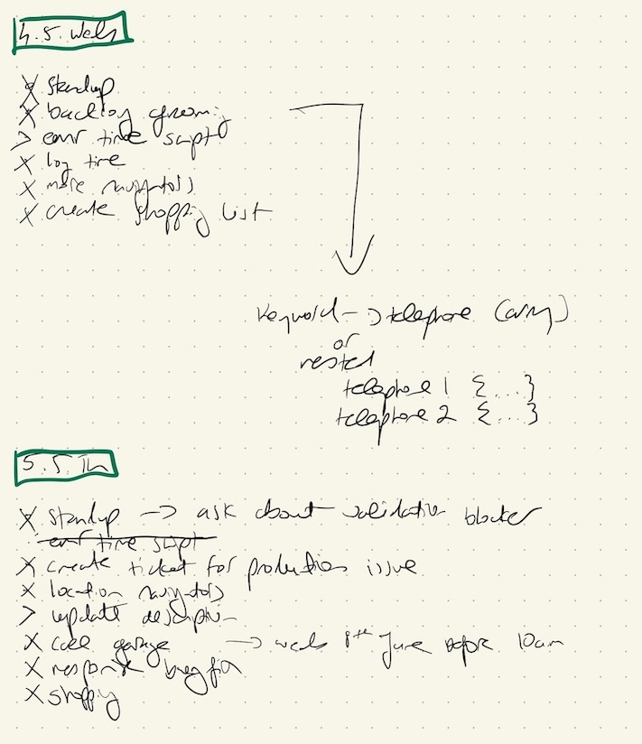
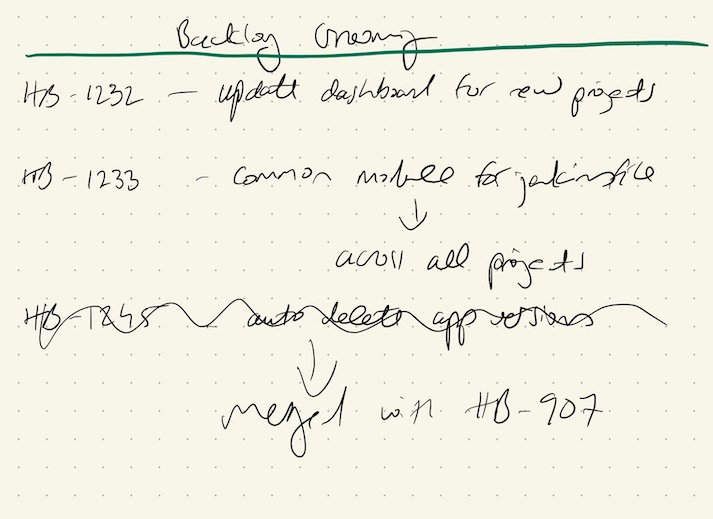

I've been using the bullet journal method since 2018. In that time I've refined it to suit my needs, helping me be more productive especially in my job as a Software Engineer.

1. [What Is The Bullet Journal Method](#what-is-the-bullet-journal-method)
2. [Life Before Bujo](#life-before-bujo)
3. [Personalisation](#personalisation)
4. [Monthly Setup](#monthly-setup)
5. [Collections For Software Engineers](#collections-for-software-engineers)
6. [Building (And Breaking) The Habit](#building-and-breaking-the-habit)

## What Is The Bullet Journal Method

If you are reading this, I’m assuming you already know a little bit about bullet journaling, so I won't be covering the basics.
It is a framework for adding some order to your daily, monthly and even yearly tasks.
[This 4-minute video](https://youtu.be/fm15cmYU0IM) is probably the best introduction and all you need to get started.

## Life Before Bujo

Previously to keep organised I enjoyed using [plaintasks with Sublime Text](https://github.com/aziz/PlainTasks) or [Todo+ with Visual Studio Code](https://github.com/fabiospampinato/vscode-todo-plus), but I often found myself mindlessly copying and pasting the same tasks day after day.
I would also write scattered notes on various post-its or in different notebooks or apps.
Using the bullet journal method allows me to keep all my tasks, notes and plans in one centralised location.

## Personalisation

Most of the examples I found when first discovering bullet journals, were made by creative types and designers.
They had beautiful handwriting and used elaborate systems of multicoloured pens. Everything was very neat and tidy.
This was intimidating as my handwriting is not the prettiest. It seemed like a lot of effort.
Maybe I could just go back to copy/pasting my to-do lists.

But by keeping it simple, I was able to find the system that works best for me.

## Monthly Setup

I use the following as my go-to setup each month:

* Calendar Page
* Funny Moments Page - A record of things that made me laugh that month, usually funny things my friends say
* Habit Tracker
* Entertainment Page - A log of albums I've listened to, films/tv shows I've watched or events I've attended etc
* Daily Log

## Collections For Software Engineers

If you are like me, you will have to attend lots of meetings, some as part of the regular agile/scrum ceremonies.
I have found that creating [collections](https://bulletjournal.com/blogs/faq/collections) for each of these meetings can be super useful.

* [Daily Stand-Up](#daily-stand-up)
* [Backlog Refinement](#backlog-refinement)
* [Retrospective](#retrospective)
* [Brag Document](#brag-document)

### Daily Stand-Up

The daily log is a perfect reference for daily stand-up meetings. I use it as a general task list and for note-taking.
It reminds me of what I worked on yesterday, and what I will be working on today.
I try to set up my log for the next day as part of my nightly routine, checking my calendar for meetings etc.
Then take any notes or rapid log during the day. Some of these notes can then be migrated to the collections below.

*Daily log used as stand‑up reference.*

### Backlog Refinement

This collection can be used to keep track of any tech debt items or bugs I think the team should work on in the upcoming sprints.
If there is not enough bandwidth for your item, it's great to have a reference point for a future sprint.
As opposed to rooting through JIRA to find that ticket I am _sure_ I created a few months back.

*Tech‑debt ideas for future sprints.*

### Retrospective

It's easy to rock up to your sprint retrospective unprepared, give zero feedback and move on with your day. I get it!
But there are times when I think "I really should have brought this up in the retro...".
Maybe it was to give praise to a colleague, or discuss how to improve a certain process.
Keeping a dedicated collection makes it easy to jot thoughts/issues as the sprint happens.

*Notes collected during the sprint for retro.*

### Brag Document

I keep collections for 1:1 meetings and check ins with my manager.
Although these collections will contain some struggles, for me, they effectively act as a brag document.
As [Julia Evans describes](https://jvns.ca/blog/brag-documents/), neither you nor your manager will remember everything you did.
Having a record of all your wins is a great confidence booster and can help with any lingering Imposter Syndrome.
When it comes to the dreaded self-assessment it is a great resource to fall back on.

## Building (And Breaking) The Habit

I think the trickiest part of bullet journaling is forming the habit to keep using it. My advice is to be patient and keep at it.
Don't try too much too soon! Start with daily logging, and build from there.

Over the years, I have often gone days, weeks even months without bullet journaling.
For whatever reason, maybe illness or life changes, sometimes it's just easier to throw away the journal. __It's ok to have these breaks!__ You can always start again, maybe with a fresh month or just pick up where you left off.
