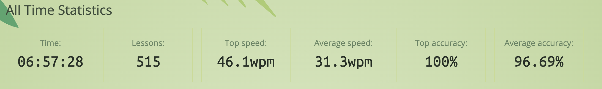
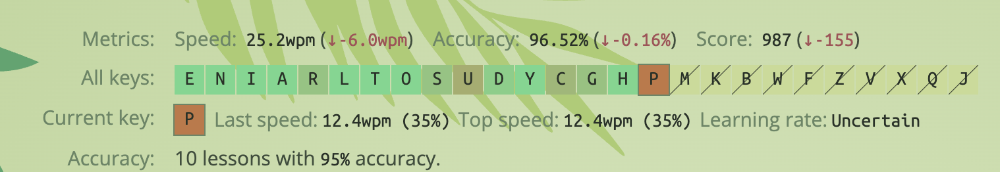

I’m about 6 weeks in.

I haven’t quite been hitting the daily quota, but I haven’t quit either.
**TW:** the word *finger* is used a lot here.

## Stats

An average typing speed of about **30 words per minute** sounds bad… but I can definitely see the progress.

*Keybr progress at Week 6*

## Learning

### Ouchies

I will rate the physical and mental pain of each step so far.

|   Step   | Letters / Notes | Ouchies |
|:--------:|------------------|:-------:|
| 🏠 **1** | Resting on the home keys | 😖😖 |
| 🚀 **2** | A, E, I, L, N, R | 😖😖😖😖️ |
| 🤏 **3** | *Danger Here:* T | 😖😖😖😖😖 |
| 🔠 **4** | O, S | 😖😖😖😖 |
| 💀 **5** | *Are U Serious?* | 😖😖😖😖😖 |
| 🧗 **6** | D, Y, C, G, H | 😖😖😖😖️ |

---

*All keys progress so far. P looking intimidating.*

## Observations

- Both left and right hand both had challenges.
- Using the left pinky for **A** was a struggle.
- Bending my right index finger to reach **N** was rough.
	- I felt instantly demoralised… but a few lessons later, it was fine.
- The delight of unlocking **T** was short-lived.
  - It took more than double the number of lessons to unlock the next letter. Tough going.
- It's interesting how you think you've mastered some letters, until introducing a new section of the keyboard completely fecks you over.

## The Final Boss: The Whole Keyboard

So far, it’s been challenging, but I’m confident I’ll have this (🌰 nut??) cracked soon enough.

Slow and steady wins the race.

Sometimes.
