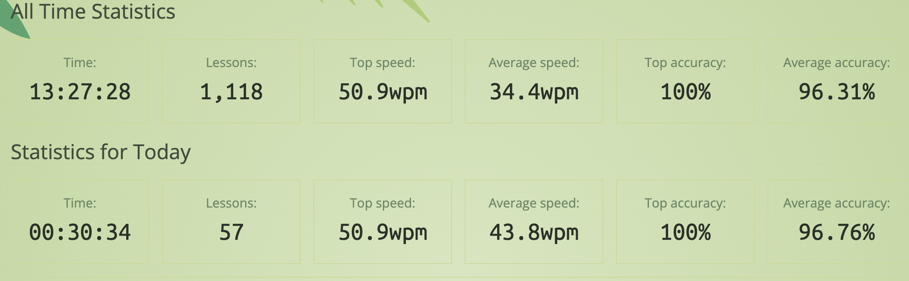
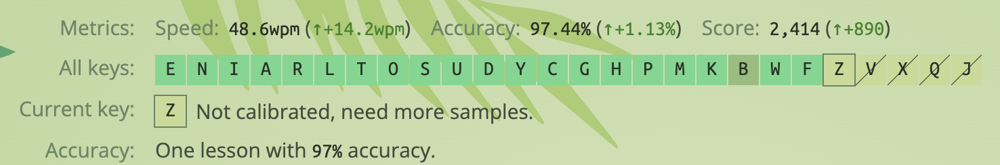

About 12 weeks in.

Still not strictly daily practicing, but I am improving.

## Stats

Hit my top speed tonight! Average speed improving. Average accuracy worsening. 😆

*Keybr progress at Week 12*

## Learning

### Ouchies

I will rate the physical and mental pain of each step so far.

|    Step    | Letters / Notes    | Ouchies |
|:----------:|--------------------|:-------:|
|  🧘 **7**  | P is for Patience  | 😖😖😖😖️ |
|  🚧 **8**  | Emmm               | 😖😖😖😖️ |
|  🪶**9**   | K easy             | 😖 |
| 🐝 **10**  | B - Buzz right off | 😖😖😖😖😖 |
| 🕸️ **11** | www dot ouch       | 😖😖😖 |
|  🖕**12**  | F - eff right off  | 😖😖😖😖😖 |

---

*All keys progress so far.*

## Observations

- My left hand is a lot tougher to learn with than I expected. I thought I was reasonably ambidextrous before now
- Again, introducing a new key can revert previous progress
  - I finally thought I had B conquered, but when I started typing with F, I basically lost B **AND** C.
    - (**and** D...)
- I have five letter keys left; 4/5 require my **non-dominant, weaker, unreliable, awkward** left hand not to be an arsehole. Let's see how it goes!
- Adding more letters has led to a speed improvement and an accuracy nose dive. But I feel accuracy is slowly catching up again.

*Accuracy, Speed, Number Of Keys*

## New Year New Keys

Still optimistic I will get there!
