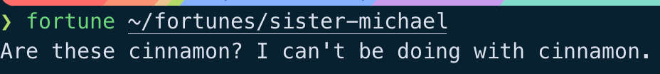
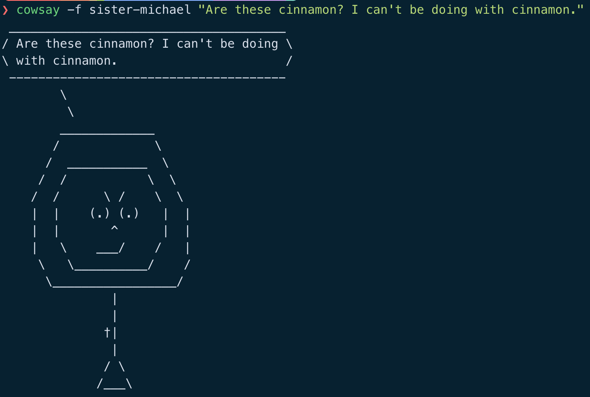
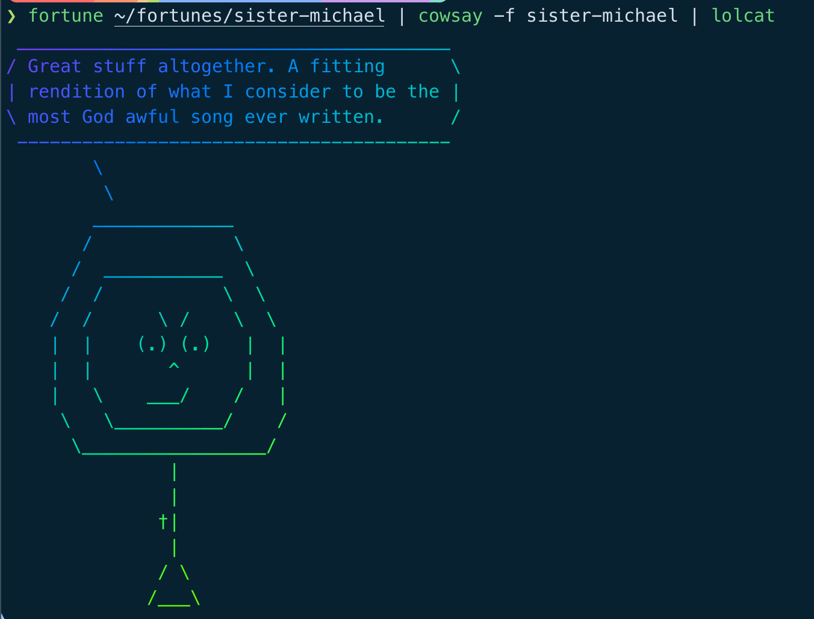

# Terminal Message Of The Day

I have switched back to iTerm2 after playing around a few terminal emulators on my personal machine.
In my day job I have few terminal options, so I want to be uniform with commands, shortcuts, etc.

When configuring my starship prompt, I faced an issue.
I went down a few rabbit holes and also happened to stumble across an unrelated [Learn Linux TV video](https://youtu.be/vmHuE6YbvTE?si=essXJDWaQXGHQKBo).

So here we are.

## Very Important Backstory

I ran some Twitter bots a few years ago (RIP) one of which was a Sister Michael bot.

Sister Michael is a character from the TV show **Derry Girls**, a sarcastic nun with some great quotes.

All steps are for macOS.

## Install packages
First, we install all the programs that do the hard stuff for us.

```shell
brew install fortune
brew install cowsay
brew install lolcat
```

## Fortune

Fortune gives you a random quote.
It has its own bank of quotes and many different options. But I have a file of Sister Michael quotes from her bot days, let's use that.
Per the man page:

```shell
The user may specify alternate sayings.  You can specify a specific file, a directory which contains one or more files, or the special word all which says to use all the standard databases.  Any of
these may be preceded by a percentage, which is a number n between 0 and 100 inclusive, followed by a %.
```
So copy the quotes over to `~/fortunes/sister-michael` or any path you like. They need to include a % between each line

Sample fortune file content:

```text
Well I think it's safe to say, we all just lost a bit of respect for you there, Clare.
%
You might want to think about wising up.
%
Well, I'm at a wake, Mr. Quinn, so I've had better evenings.
```

We need to convert to a *dat* file format, the **strfile** command can do that. Per its man page:
```shell
strfile reads a file containing groups of lines separated by a line containing a single percent `%` sign (or other specified delimiter character) and creates a data file which contains a header structure and a table of file offsets for each group of lines. This allows random access of the strings.
```

```shell
strfile ~/fortunes/sister-michael
```

### Fortune command output:



## Cowsay

Cowsay lets you make ASCII cows say things.
There are also plenty of other options built in like koalas or Darth Vader or Darth Koala, you get the gist.


But I want Sister Michael. (Darth Sister? Sister Koala?)

From the cowsay man pages:

```shell
Cow selection
       -f
           Specifies a particular cow picture file (cowfile) to use.  If the cowfile spec resolves to an existing file, then it will be interpreted as a path to the cowfile.  Otherwise, cowsay will search the
           COWPATH for a cowfile with that name (and a .cow extension).  Additional cowpath entries may be specified in the COWPATH environment variable.  To list all cowfiles on the current COWPATH, call
           cowsay -l.
```


I got help from JetBrain's Junie to create an ASCII Sister Michael, but it was a bit too cute.
I tried my best to give her an edge, without looking like The Nun from the Conjuring universe.

We need to save our lovely new cow in `/opt/homebrew/share/cowsay/cows/sister-michael.cow`

### Issues I found when rendering the ASCII via cowsay:
- It is a bit fiddly! a few attempts may be required
- The "\\" character needs to be escaped, else it won't be in your output.
- For the quote bubble to have thought bubbles, you need to use the variable "$thoughts"

### Cow file content:
```bash

## sister-michael.cow
## Cow: Sister Michael

$the_cow = <<EOC;
        $thoughts
         $thoughts
        _____________
       /             \\
      /  ___________  \\
     /  /           \\  \\
    /  /      \\ /    \\  \\
    |  |    (.) (.)   |  |
    |  |       ^      |  |
    |   \\    ___/    /   |
     \\   \\__________/    /
      \\_________________/
               |
               |
              †|
               |
              / \\
             /___\\
EOC
```

### Cowsay command output:



### Lolcat

lolcat lets the ASCII cow look fancy and colourful.

### Put them all together:




## Adding a message of the day

Modern macOS doesn't have a message of the day file like linux, but we can add one.

```shell
echo "fortune ~/fortunes/sister-michael | cowsay -f sister-michael | lolcat" > motd.sh
chmod +x motd.sh
```

Add the command itself or `./motds.sh` to your .zshrc or .bashrc file and you are laughing.

## How did I get here?

The colours on my prompt were off, different shades in sections that had text, like the time.
Messed with starship settings, no joy. Tried with iTerm2 settings, nothing.
While typing this up I tried again and spotted the culprit.

`iTerm2 settings -> profiles -> window -> Check the box "Keep background colours opaque".
`

Now the prompts look how I intended, *and* I get a message from Sister Michael in every new terminal session.

As herself once said, *"I'd get buttering if I were you."*
