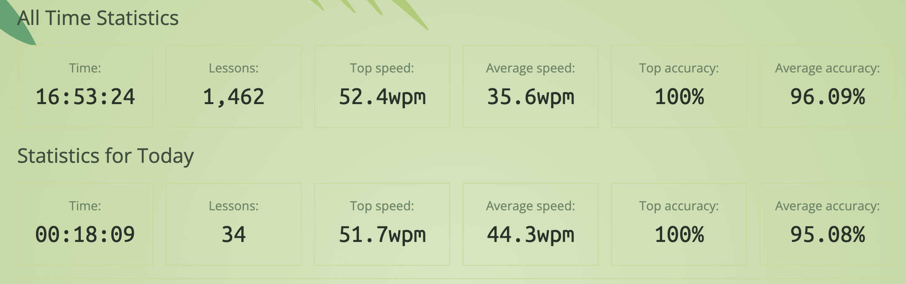
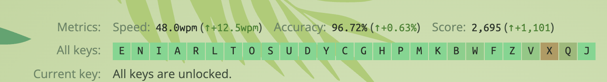
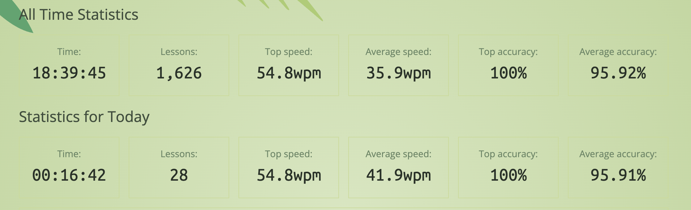
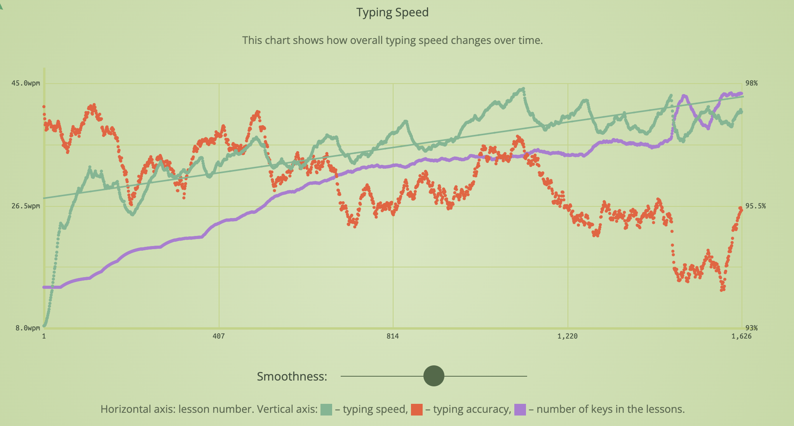

About 5 months in to this annoying but fun little journey.

I finally unlocked all the letters in keybr practice mode back in January.
However, things took a turn after that milestone!

## Stats

*Keybr progress at Week 15*

## Learning

### Ouchies

I will rate the physical and mental pain of each step so far.

|    Step    | Letters / Notes    | Ouchies |
|:----------:|--------------------|:-------:|
| 🐒 **13**  | Zippidy do dah     | 😖😖😖️ |
| 🦖 **14**  | Velociraptor hands | 😖😖😖️ |
|  ❌ **15**  | X marks the spot   | 😖😖😖😖 |
| 🤓 **16**  | Quite Unintelligent | 😖😖😖😖😖 |
| ⬇️️ **17** | Jlo west ouchies   | 😖 |

---

*All keys progress, all unlocked!*

### Where do we go from here?

- I was delighted when I finally cracked all the letters in keybr practice mode.
- That delight unfortunately did not last long, as it is not even half the battle. I may have miscalculated the remaining effort.
- Symbols, numbers, uppercase letters, using layers on the ZSA Voyager. **EEEK**. A lot to figure out.
- My _original_ plan was to get comfy with all the letters using keybr, then move over to the training section of the ZSA website.
  - This was a bad idea, as **I still cannot type properly yet**. Lowercase letters, I can do, everything else, not yet.
  - I was hoping there would be a way to introduce symbols one by one, but I have not been able to make that work on keybr.com
- So I spent a few weeks in a frustrating kind of limbo. But I think I have path forward.

### Touch Type Plan 2.0

- Something you _can_ do in keybr.com is to slowly introduce uppercase letters and punctuation marks.
- I tried initially at like 30% but this was too hard, so I have reduced it to 10% for now. So 10% rate of characters will be uppercase, 10% punctuation.
- This has finally lead to an increase in speed and accuracy again.
- I will slowly increase these rates once I feel confident
- I am switching between keybr and the ZSA training. The more confident I get with keybr, the more I will introduce different ZSA lessons.
- Trying to write code is not on the horizon yet, I need to get way better with symbols and finding where they are located in Voyager layers.

## Stats at week 20

*Keybr progress at Week 20*

Limbo and trying too much at once brought down the accuracy and speed but hopefully on an upward trend again now.

## Voyager Keyboard layout

One thing that became clear when I tried typing with numbers and symbols is that I absolutely don't want to use the number row.
Nein danke.

Being so familiar now with the regular qwerty letters in the columnar layout, it seems like a lot of effort to reach outside the comfort zone.
So I am looking forward to playing with different layers and layouts, maybe a 34-key system. But a lot to do before then.

Typing on a regular keyboard is still fine, so I am happy to keep patiently plodding along to the next stages.

*Accuracy, Speed, Number Of Keys Graph*

I am not too bothered about improving my typing speed, around 50 wpm is already pretty great for me, faster than I am on a regular keyboard.
But I hope now with my new plan I will keep increasing the accuracy and comfortably learn new keys.

## Onwards and sideways

Until next time!
